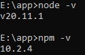
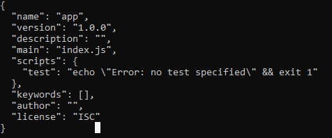
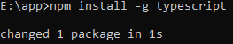
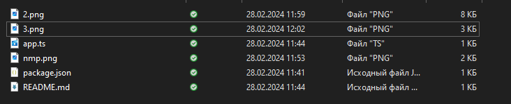
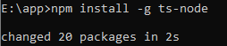
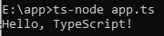

# 5 задание 
---
1. Установка Node.js:
    - Скачал и установил Node.js с [официального сайта](https://nodejs.org/en).
    - Убедился, что Node.js и npm (Node Package Manager) успешно установлены, выполнив в терминале команды:
      
      node -v
      npm -v

      
---
1. Создание проекта:
    - Создал новую директорию для своего проекта.
    - В этой директории выполнил команду для инициализации проекта:
    npm init -y
    - Cоздаkcz файл `package.json`, который содержит информацию о проекте.
  
      

2. Установка TypeScript:
    - Установите TypeScript глобально, выполнив команду:
    npm install -g typescript

      
    
3. Создание файла TypeScript:
    - Создал файл `app.ts` в своей директории проекта.
  
      

    - Внутри этого файла написал простой TypeScript код:
      
      >const message: string = 'Hello, TypeScript!';
      >
      >console.log(message);
3. Установка ts-node:
    - Установил библиотеку `ts-node`, которая позволяет запускать TypeScript файлы напрямую, выполнив команду:
    npm install -g ts-node

       

4. Запуск приложения:
    - Запустил TypeScript приложение с помощью `ts-node`, выполнив команду:
    ts-node app.ts

        

5. Завершение задания:
    - Убедился, что приложение работает корректно и выводит сообщение в консоль.
    - Создал файл `README.md`, где описал шаги для установки Node.js, настройки проекта и запуска приложения.
